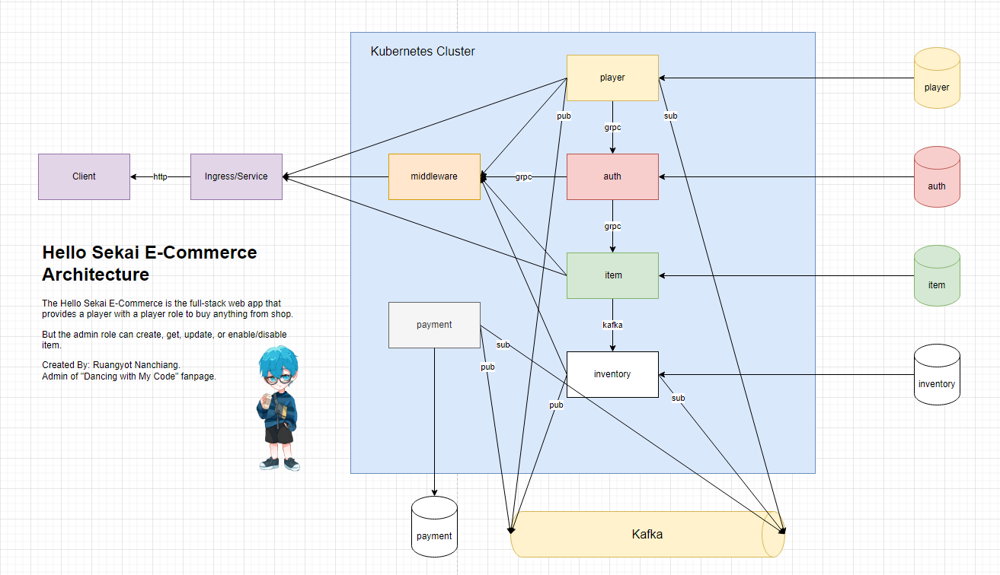

<h1>⚔️ Hello Sekai Shop Microservices</h1>

<h2>📝 Architecture</h2>



<h2>📦 Packages</h2>

```bash
go get github.com/labstack/echo/v4
go get github.com/labstack/echo/v4/middleware
go get github.com/go-playground/validator/v10
go get github.com/joho/godotenv
go get go.mongodb.org/mongo-driver/mongo
go get github.com/golang-jwt/jwt/v5
go get github.com/stretchr/testify
go get github.com/IBM/sarama
```

<h2>📃 Start App in Terminal</h2>

```bash
go run main.go ./env/dev/.env.auth
```
```bash
go run main.go ./env/dev/.env.item
```
```bash
go run main.go ./env/dev/.env.player
```
```bash
go run main.go ./env/dev/.env.inventory
```
```bash
go run main.go ./env/dev/.env.payment
```

<h2>🍃 MongoDb</h2>

<p>Start Docker Compose for Kafka</p>

```bash
docker compose -f docker-compose.db.yml up -d
```

<p>Enter into a db container</p>

```bash
docker exec -it <db_name> bash
```

<p>Migration</p>

<p>dev</p>

```bash
go run ./pkg/database/script/migration.go ./env/dev/.env.player && \
go run ./pkg/database/script/migration.go ./env/dev/.env.auth && \
go run ./pkg/database/script/migration.go ./env/dev/.env.item && \
go run ./pkg/database/script/migration.go ./env/dev/.env.inventory && \
go run ./pkg/database/script/migration.go ./env/dev/.env.payment
```

<p>prod</p>

```bash
go run ./pkg/database/script/migration.go ./env/prod/.env.player && \
go run ./pkg/database/script/migration.go ./env/prod/.env.auth && \
go run ./pkg/database/script/migration.go ./env/prod/.env.item && \
go run ./pkg/database/script/migration.go ./env/prod/.env.inventory && \
go run ./pkg/database/script/migration.go ./env/prod/.env.payment
```


<h2>🦋 Kafka Command</h2>

<p>Start Docker Compose for Kafka</p>

```bash
docker compose -f docker-compose.kafka.yml up -d
```

<p>Enter into the Kafka container</p>

```bash
docker exec -it kafka-1 bash
```

<p>Create a topic</p>

```bash
./opt/bitnami/kafka/bin/kafka-topics.sh --create --topic inventory --replication-factor 1 --partitions 1 --bootstrap-server localhost:9092
./opt/bitnami/kafka/bin/kafka-topics.sh --create --topic payment --replication-factor 1 --partitions 1 --bootstrap-server localhost:9092
./opt/bitnami/kafka/bin/kafka-topics.sh --create --topic player --replication-factor 1 --partitions 1 --bootstrap-server localhost:9092
```

<p>Add topic retention</p>

```bash
./opt/bitnami/kafka/bin/kafka-configs.sh --bootstrap-server localhost:9092 --entity-type topics --entity-name inventory --alter --add-config retention.ms=180000
./opt/bitnami/kafka/bin/kafka-configs.sh --bootstrap-server localhost:9092 --entity-type topics --entity-name payment --alter --add-config retention.ms=180000
./opt/bitnami/kafka/bin/kafka-configs.sh --bootstrap-server localhost:9092 --entity-type topics --entity-name player --alter --add-config retention.ms=180000
```

<p>See all topics list</p>

```bash
./opt/bitnami/kafka/bin/kafka-topics.sh --list --bootstrap-server localhost:9092
```

<p>Describe topic</p>

```bash
./opt/bitnami/kafka/bin/kafka-topics.sh --describe --topic inventory --bootstrap-server localhost:9092
./opt/bitnami/kafka/bin/kafka-topics.sh --describe --topic payment --bootstrap-server localhost:9092
./opt/bitnami/kafka/bin/kafka-topics.sh --describe --topic player --bootstrap-server localhost:9092
```

<p>Write a message into the topic</p>

```bash
./opt/bitnami/kafka/bin/kafka-console-producer.sh --topic inventory --bootstrap-server localhost:9092 
./opt/bitnami/kafka/bin/kafka-console-producer.sh --topic payment --bootstrap-server localhost:9092 
./opt/bitnami/kafka/bin/kafka-console-producer.sh --topic player --bootstrap-server localhost:9092
```

<p>Write a message with key into the topic</p>

```bash
--property "key.separator=:" --property "parse.key=true"
```

<p>Read a message on that topic</p>

```bash
./opt/bitnami/kafka/bin/kafka-console-consumer.sh --topic inventory --from-beginning --bootstrap-server localhost:9092
./opt/bitnami/kafka/bin/kafka-console-consumer.sh --topic payment --from-beginning --bootstrap-server localhost:9092
./opt/bitnami/kafka/bin/kafka-console-consumer.sh --topic player --from-beginning --bootstrap-server localhost:9092
```

<p>Delete topic</p>

```bash
./opt/bitnami/kafka/bin/kafka-topics.sh --delete --bootstrap-server localhost:9092 --topic inventory
./opt/bitnami/kafka/bin/kafka-topics.sh --delete --bootstrap-server localhost:9092 --topic payment
./opt/bitnami/kafka/bin/kafka-topics.sh --delete --bootstrap-server localhost:9092 --topic player
```

<h2>🍰 Generate a Proto File Command</h2>
<p>player</p>

```bash
protoc --go_out=. --go_opt=paths=source_relative \
    --go-grpc_out=. --go-grpc_opt=paths=source_relative \
    modules/player/playerProto/playerProto.proto
```

<p>auth</p>

```bash
protoc --go_out=. --go_opt=paths=source_relative \
    --go-grpc_out=. --go-grpc_opt=paths=source_relative \
    modules/auth/authProto/authProto.proto
```

<p>item</p>

```bash
protoc --go_out=. --go_opt=paths=source_relative \
    --go-grpc_out=. --go-grpc_opt=paths=source_relative \
    modules/item/itemProto/itemProto.proto
```

<p>inventory</p>

```bash
protoc --go_out=. --go_opt=paths=source_relative \
    --go-grpc_out=. --go-grpc_opt=paths=source_relative \
    modules/inventory/inventoryProto/inventoryProto.proto
```

<h2>🐳 Build</h2>
    
<p>auth</p>

```bash
docker build -t rayato159/hello-sekai-shop:latest -f build/auth/Dockerfile .
```